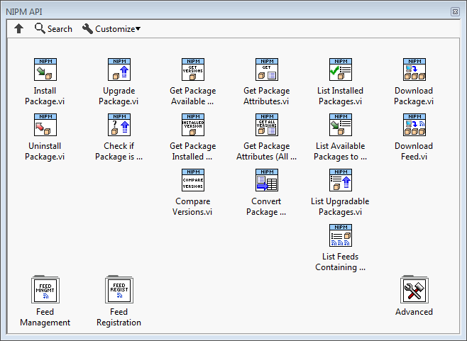

# nipm-api-labview
NI Package Manager API (Beta) for LabVIEW 2014 or later.

## Overview
My goal is to provide users with a beta API for NI Package Manager tasks.  Please feel free to use this API, give feedback, and contribute.  NI will use this feedback to create an official NIPM API in the future.

You can use this API to:
* Install/uninstall packages
* Get package attributes
* Create feeds, add packages to feeds, remove packages from feeds, list packages in feeds
* Register/unregister feeds
* ...

You can find content, tutorials, and additional tools for NI package management at [bit.ly/nipkg](http://bit.ly/nipkg)

## How to Install
Prerequisites:
* LabVIEW 2014 or later
* [NI Package Manager](http://www.ni.com/downloads/ni-package-manager) 17.5 or later

Installation Instructions
1. Click on the [Exports](https://github.com/allenh-ni/nipm-api-labview/tree/master/Exports) folder, and download the most recent .vip file (VIPM package).
2. Double-click the .vip file.  This will launch VI Package Manager to install the NIPM API to LabVIEW 2014 or later.
3. In LabVIEW, access the NIPM API by going to the **Functions Palette»Addons»NIPM API (Beta)**.
4. (Optional) Install the [NIPM Feed Manager (Beta)](https://github.com/allenh-ni/nipm-feed-manager-gui-labview), and use it to manage NIPM feeds and packages. 

## Documentation
Refer to the Context Help for the installed API.

Note: Documentation for this API is still in work.

## Source Code
* **Source** folder - Contains the source code for this API.  At a low-level, this API calls the nipkg command-line interface (CLI).
* **Build Spec** folder - Contains the VIPM build spec (.vipb) used to create the .vip file.
* **Export** folder - Contains versions of the VIPM package (.vip), which you can use to install this API.
